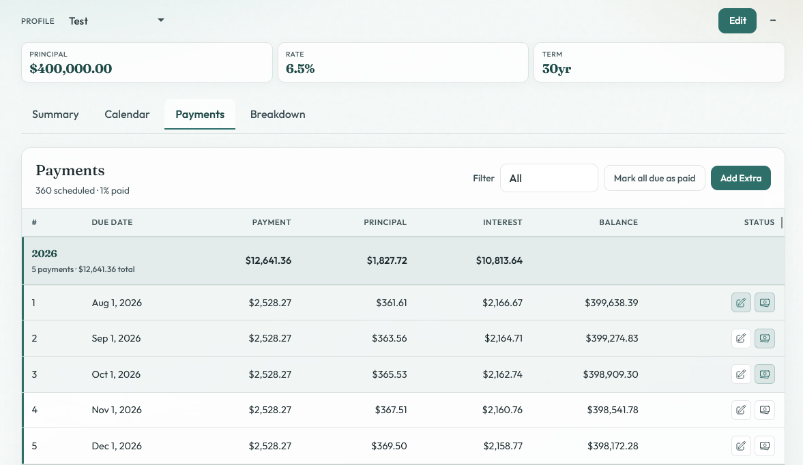

# Homeabell

This is a mortgage amortization payment schedule tracker.

It allows you keep track of your mortgage payments and share with anyone you are paying with.

## Features

* Create multiple profiles for different mortgages
* Visualize breakdown of principal vs interest on each of your payments
* Track extra payments, both normal and recast
* Share your profile with another user

## Tech

This is a server side rendered rust app using htmx for any front end interactivity, and axum, sqlx, and sqlite for the backend.

## Quick Start
* Create .env file (you can just copy the .env.sample for now)
* run `cargo run .` (assumes you have rust installed)